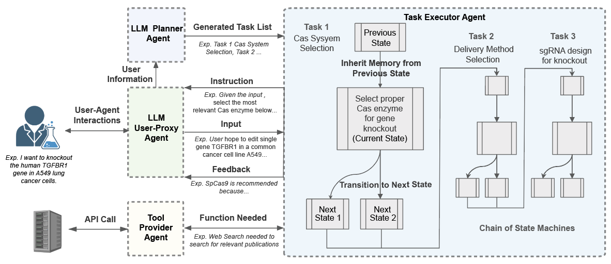

<div align="center">

# CRISPR-GPT for agentic automation of gene-editing experiments

<div>
🧬 Multi-Agent System for Automated CRISPR Experiment Design and Analysis 🔬
</div>
</div>

<div>
<br>

<div align="center">

[](https://www.nature.com/articles/s41551-025-01463-z)
[](https://genomics.stanford.edu)
[](https://www.surveymonkey.com/r/G9GCMJV)

</div>
</div>

## Overview

<p align="center">

</p>

CRISPR-GPT is an innovative Large Language Model (LLM) agent designed to automate and streamline the process of designing gene-editing experiments. By leveraging the power of advanced language models, CRISPR-GPT assists researchers in planning, executing, and analyzing CRISPR-based gene editing tasks with unprecedented efficiency and accuracy.

CRISPR-GPT supports four primary gene-editing modalities: **knockout**, **base-editing**, **prime-editing**, and **epigenetic editing**. The system automates 22 individual tasks including CRISPR/Cas system selection, sgRNA design, off-target prediction, delivery method optimization, and experimental validation protocols. Users can interact with CRISPR-GPT through three distinct modes: (1) **Meta mode** for step-by-step guidance on pre-defined gene-editing workflows, (2) **Auto mode** for customized guidance on free-style user requests, and (3) **QA mode** for real-time answers to ad hoc questions. These modes accommodate different user expertise levels and experimental requirements, from novice researchers seeking structured guidance to experienced scientists needing flexible, custom workflows or quick troubleshooting support.

**Related Work**: This project builds upon our [Genome-Bench](https://github.com/mingyin0312/RL4GenomeBench) research, which developed RL fine-tuning methods to inject expert knowledge from 10+ years of genomics discussions into language models.

## Architecture



The backbone of CRISPR-GPT involves multi-agent collaboration between four core components:

1. **LLM Planner Agent**: Configures tasks and performs automatic task decomposition and planning based on user requests
2. **Task Executor Agent**: Implements the chain of state machines from the Planner Agent and manages workflow execution
3. **LLM User-Proxy Agent**: Interfaces with the Task Executor on behalf of users, enabling monitoring and corrections
4. **Tool Providers**: Support diverse external tools and connect to search engines or databases via API calls

## Getting Started

**Code Coming Soon!** We are preparing the CRISPR-GPT codebase for public release.

## Citation

```bibtex
@article{qu2025crisprGPT,
  title={CRISPR-GPT for agentic automation of gene-editing experiments},
  author={Qu, Yuanhao and Huang, Kaixuan and Yin, Ming and others},
  journal={Nature Biomedical Engineering},
  year={2025},
  doi={10.1038/s41551-025-01463-z},
  url={https://doi.org/10.1038/s41551-025-01463-z}
}
```

## Contact

For questions, suggestions, or collaborations, please contact:

**CRISPR-GPT Team**:
- Yuanhao Qu: [yhqu@stanford.edu](mailto:yhqu@stanford.edu)  
- Kaixuan Huang: [kaixuanh@princeton.edu](mailto:kaixuanh@princeton.edu)
- Mengdi Wang: [mengdiw@princeton.edu](mailto:mengdiw@princeton.edu)
- Le Cong: [congle@stanford.edu](mailto:congle@stanford.edu)

---
